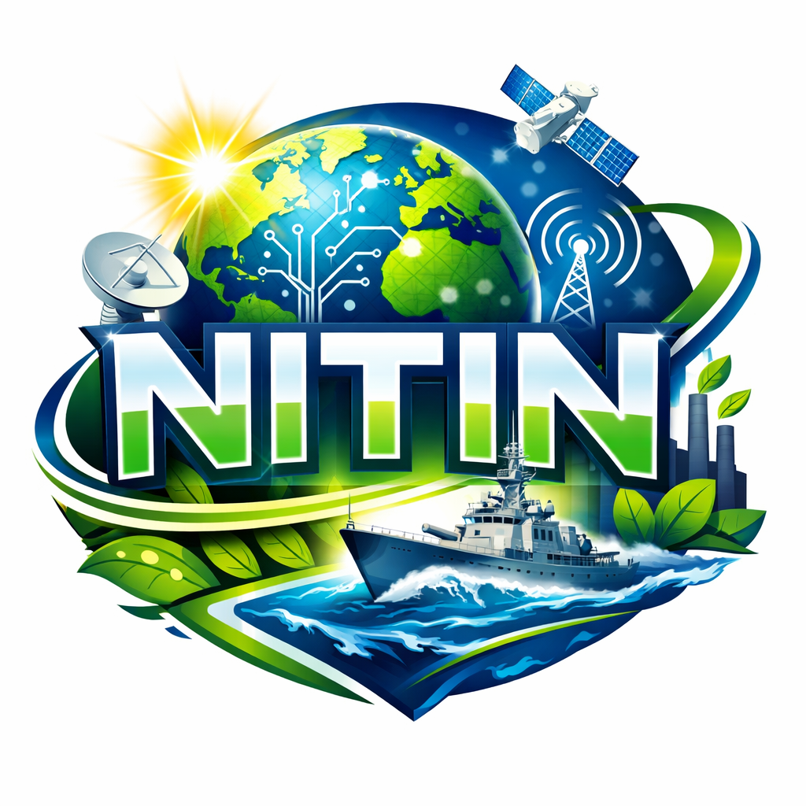

<div align="center">



# NITIN

### Naval Imagery and Target Identification Network

**Ship Detection & Classification System** powered by YOLO + ConvNeXT deep learning, with a real-time command-center dashboard, role-based access control, inter-user messaging, and an India-wide alert dispatch map.

<p>
  
  
  
  
  
  
</p>

</div>

---

## Overview

NITIN is an end-to-end naval surveillance platform that ingests satellite/imagery files, detects ships with a YOLO object detector, classifies each detection into one of **23 vessel classes** using a ConvNeXT-Large backbone, and visualizes everything on a live tactical dashboard. A built-in messaging system and India-state alert map let command posts coordinate responses to military-class detections in real time.

> Built as a pre-final-year / capstone AI project — designed to look and feel like a real naval command console.

---

## Key Features

### AI Detection Pipeline
- **YOLO** object detection — finds ships in raw imagery with bounding boxes
- **ConvNeXT-Large** image classification — 23-class FGSC-23 vessel taxonomy
- Annotated image output with detection + classification overlays
- Automatic EXIF-based timestamping per image
- Ship-only storage — non-ship images are filtered out and never persisted

### Tactical Dashboard
- **Live ship map** — animated pulse markers, military vessels highlighted red
- **Analytics** — ship class distribution bar chart + detections-over-time line chart
- **Records table** — sortable detections with confidence badges and image lightbox
- **Ship list sidebar** — click any vessel to fly to its map marker
- Manual marker placement with lat/lon coordinates

### Alert Dispatch System
- Interactive **India state map** with all 36 states & UTs
- One-click alert to any state's command center
- Visual confirmation of dispatched alerts with a running counter

### Authentication & Roles
- Token-based session auth (12-hour expiry, httponly cookies)
- Three roles with distinct permissions:

| Role | Capabilities |
|------|-------------|
| **Admin** | Full access — run pipeline, manage users, send/broadcast messages, all tabs |
| **Command Post** | View dashboard, send targeted & broadcast messages, dispatch alerts |
| **Viewer** | Read-only access to map, analytics, records, and inbox |

- SHA-256 + salt password hashing
- Admin can enable/disable user accounts

### Messaging System
- Inbox / Sent / Compose tabs
- Send to specific users or **broadcast to all active users**
- Unread message badges in topbar + messages tab
- Read receipts tracked per user
- Admin-only message deletion

---

## Vessel Classification Taxonomy (FGSC-23)

The classifier recognizes **23 ship classes** across military and civilian categories:

<details>
<summary><b>Military vessels (11 classes)</b></summary>

| # | Class |
|---|-------|
| 1 | Air Carrier |
| 2 | Destroyer |
| 3 | Landing Craft |
| 4 | Frigate |
| 5 | Amphibious Transport Dock |
| 6 | Cruiser |
| 7 | Tarawa-class Amphibious Assault Ship |
| 8 | Amphibious Assault Ship |
| 9 | Command Ship |
| 10 | Submarine |
| 11 | Combat Boat |

</details>

<details>
<summary><b>Civilian vessels (11 classes)</b></summary>

| # | Class |
|---|-------|
| 12 | Auxiliary Ship |
| 13 | Container Ship |
| 14 | Car Carrier |
| 15 | Hovercraft |
| 16 | Bulk Carrier |
| 17 | Oil Tanker |
| 18 | Fishing Boat |
| 19 | Passenger Ship |
| 20 | Liquefied Gas Ship |
| 21 | Barge |

</details>

Military-class detections are automatically flagged with pulsing red badges throughout the UI.

---

## Tech Stack

| Layer | Technology |
|-------|-----------|
| **Backend** | Flask 3.0, Python 3.9+ |
| **Database** | MongoDB 7.0 (PyMongo driver) |
| **AI / Detection** | PyTorch, Ultralytics YOLOv8, Timm ConvNeXT-Large |
| **Frontend** | Vanilla HTML/CSS/JS, Leaflet.js (maps), Chart.js (analytics) |
| **Auth** | Custom token store, SHA-256 + salt hashing |
| **Fonts** | Orbitron, Share Tech Mono, Rajdhani |

---

## Project Structure

```
NITIN/
├── app.py                 # Main Flask server — routes, pipeline control, image serving
├── arena_test.py          # AI pipeline — YOLO detection + ConvNeXT classification + MongoDB storage
├── auth.py                # Authentication blueprint — signup, login, token management, user CRUD
├── messaging.py           # Messaging blueprint — send, inbox, sent, read receipts
├── check_setup.py         # Pre-flight diagnostics script
├── requirements.txt       # Python dependencies
├── models/
│   ├── best.pt            # YOLOv8 detection weights (LFS-tracked)
│   └── transfer.pth       # ConvNeXT-Large classification weights (LFS-tracked)
└── static/
    ├── login.html         # Login + registration page
    ├── index.html         # Main tactical dashboard
    └── images/
        └── logo.png       # NITIN logo
```

### Database Layout

| Database | Collection(s) | Purpose |
|----------|---------------|---------|
| `user_list` | `users` | Accounts, roles, credentials |
| `user_list` | `messages` | Inter-user messages & read receipts |
| `ship_detection_db` | `<YYYY-MM-DD>` | One collection per date — detection results, bounding boxes, annotated images (base64) |

---

## Getting Started

### Prerequisites

- Python 3.9 or higher
- MongoDB 7.0+ running on `localhost:27017`
- PyTorch-compatible GPU recommended (falls back to CPU automatically)

### Installation

```bash
# 1. Clone the repository
git clone <repo-url>
cd NITIN

# 2. Install Python dependencies
pip install -r requirements.txt

# 3. Ensure model weights are present (Git LFS)
git lfs pull
# Verify:
ls -lh models/best.pt models/transfer.pth
#   best.pt       ~57 MB
#   transfer.pth  ~785 MB

# 4. Start MongoDB
#    Windows : net start MongoDB
#    Linux   : sudo systemctl start mongod
#    macOS   : brew services start mongodb-community
```

### Configuration

Edit the paths in `arena_test.py` → `CONFIG` dict to match your system:

```python
CONFIG = {
    'yolo_model_path':              '/path/to/models/best.pt',
    'classification_model_path':    '/path/to/models/transfer.pth',
    'input_folder':                 '/path/to/input_images',
    'output_object_folder':         '/path/to/output/ship',
    'output_no_object_folder':      '/path/to/output/no_ship',
    'info_folder':                  '/path/to/output/info',
    'confidence_threshold':         0.25,
}
```

Drop `.jpg`, `.png`, `.bmp`, or `.tiff` images into your `input_folder` before running the pipeline.

### Pre-flight Check

```bash
python check_setup.py
```

Verifies Python version, packages, MongoDB connectivity, model files, and frontend assets.

### Run the System

```bash
python app.py
```

```
============================================================
  NITIN — Ship Detection System
  Local  : http://localhost:5000
  Network: http://<your-lan-ip>:5000   ← share with other devices
============================================================
```

Open `http://localhost:5000` in your browser, register an account, and sign in.

---

## Usage Guide

### For Admins
1. Sign in and click **Load AI Models** in the left panel
2. Click **Run Detection** — the pipeline processes every image in the input folder
3. Watch the live log and progress bar as images are detected, classified, and stored
4. Switch between **Map**, **Analytics**, **Records**, and **Alert** tabs
5. Use the **Users** tab to enable/disable accounts
6. Send messages via the **Messages** tab — targeted or broadcast

### For Command Posts
1. Sign in — full dashboard access (no pipeline control)
2. View all detections, analytics, and the ship map
3. Dispatch alerts to any Indian state via the **Alert** tab
4. Send and receive messages

### For Viewers
1. Sign in — read-only access
2. Browse the map, analytics, and records
3. Receive and read messages (cannot send)

---

## API Reference

### Authentication
| Method | Endpoint | Auth | Description |
|--------|----------|------|-------------|
| `POST` | `/api/auth/signup` | Public | Create a new account |
| `POST` | `/api/auth/login` | Public | Authenticate and receive token |
| `POST` | `/api/auth/logout` | Token | Revoke session |
| `GET` | `/api/auth/me` | Token | Get current user info |
| `GET` | `/api/auth/states` | Public | List Indian states for signup |

### User Management (admin only)
| Method | Endpoint | Auth | Description |
|--------|----------|------|-------------|
| `GET` | `/api/users` | Admin | List all users |
| `POST` | `/api/users/<id>/toggle` | Admin | Enable/disable a user |
| `GET` | `/api/users/recipients` | Admin/Cmd | List messageable users |

### Messaging
| Method | Endpoint | Auth | Description |
|--------|----------|------|-------------|
| `POST` | `/api/messages/send` | Admin/Cmd | Send or broadcast a message |
| `GET` | `/api/messages/inbox` | Token | Get inbox messages |
| `GET` | `/api/messages/sent` | Admin/Cmd | Get sent messages |
| `GET` | `/api/messages/<id>` | Token | Get a single message |
| `POST` | `/api/messages/<id>/read` | Token | Mark message as read |
| `GET` | `/api/messages/unread_count` | Token | Get unread count |
| `DELETE` | `/api/messages/<id>/delete` | Admin | Delete a message |

### Pipeline & Data
| Method | Endpoint | Auth | Description |
|--------|----------|------|-------------|
| `GET` | `/api/status` | Token | System status (DB, models, pipeline) |
| `POST` | `/api/models/load` | Admin | Load YOLO + classifier into memory |
| `POST` | `/api/pipeline/run` | Admin | Start batch detection pipeline |
| `GET` | `/api/pipeline/status` | Token | Live pipeline progress + logs |
| `GET` | `/api/input/images` | Admin | List images in input folder |
| `GET` | `/api/images/ship/<filename>` | Token | Serve annotated ship image |
| `GET` | `/api/db/collections` | Token | List date collections |
| `GET` | `/api/db/<collection>` | Token | Get all records for a date |
| `GET` | `/api/db/all/map` | Token | Get all records for map plotting |
| `GET` | `/api/stats` | Token | Aggregate statistics |
| `GET` | `/api/config` | Token | Pipeline configuration |

All authenticated endpoints expect an `X-Auth-Token` header or `nitin_token` cookie.

---

## Dashboard Preview

The interface features a dark military command-console aesthetic with:

- **Animated grid background** and scanline overlay for a CRT-monitor feel
- **Neon cyan / green / red** accent system with glow effects
- **Pulsing map markers** — green for civilian ships, red for military
- **Real-time system clock** in the topbar
- **Live DB/Model connection indicators** with blinking status dots
- **Orbitron + Share Tech Mono** typography for a tactical HUD look
- **Military vessel badges** with pulsing red glow animations
- **Responsive grid layout** — 3-panel dashboard (control / main / ship list)

---

## Security Notes

- Passwords are hashed with SHA-256 + per-user random salt
- Session tokens expire after 12 hours
- Role-based access control enforced on every API endpoint
- Model weights are Git LFS-tracked (57 MB + 785 MB)
- All CORS origins are allowed for LAN deployment — restrict in production

> For production deployment, replace the in-memory token store with Redis, set a fixed `secret_key`, and tighten CORS to your domain.

---

## Troubleshooting

| Problem | Solution |
|---------|----------|
| `Could not import arena_test` | Ensure `arena_test.py` is in the same directory as `app.py` |
| MongoDB connection failed | Start MongoDB service, verify port 27017 is open |
| `Models not loaded` error | Click "Load AI Models" before running the pipeline |
| No images found | Place image files in the configured `input_folder` |
| Model weights missing | Run `git lfs pull` to download `.pt` and `.pth` files |
| GPU not detected | PyTorch falls back to CPU automatically — detection will be slower |
| Login fails on other devices | Use the Network URL shown at startup, not `localhost` |

---

## License

This project is licensed under the **MIT License**.

---

<div align="center">

**NITIN** — *Naval Imagery and Target Identification Network*

Built for naval surveillance, defense research, and maritime intelligence.

</div>
